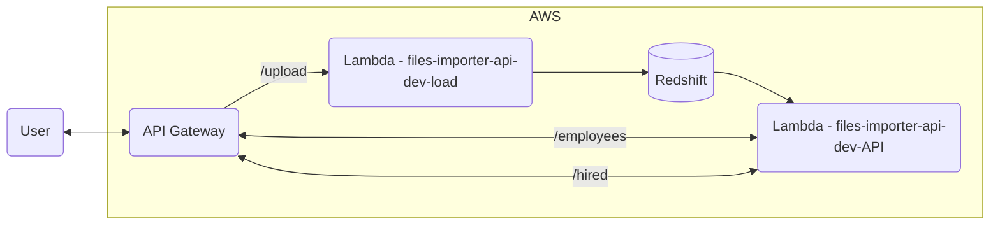

# Files Importer API

The `files-importer-api` is a Serverless application designed to facilitate the efficient import and management of CSV files. It leverages AWS services, including S3 for file storage and AWS Redshift for data processing. The API provides endpoints for uploading CSV files, retrieving employee data, and accessing information about hired employees.

**AWS Resources**:

- [AWS Redshift](https://aws.amazon.com/redshift/):  The project leverages the unparalleled data warehousing capabilities of Amazon Redshift, seamlessly integrating it with the files-importer-api to process and analyze employee data efficiently.
- [Amazon S3 Bucket](https://aws.amazon.com/s3/): The heart of the data storage solution lies in Amazon S3 buckets, providing scalable, secure, and durable object storage for the CSV files managed by the files-importer-api.
- [AWS Lambda](https://docs.aws.amazon.com/lambda/): AWS Lambda is a compute service that runs your code in response to events and automatically manages the compute resources, making it the fastest way to turn an idea into a modern, production, serverless applications. With pay as you go model.

**Architecture**



**Features**

- Scalability: Enjoy the benefits of effortless scalability across the entire serverless architecture, adapting to the demands of your data processing and file management needs.
- Cost-Effective: With a serverless approach, you only pay for the compute resources you use, ensuring optimal cost-effectiveness in both the serverless data ecosystem and the files-importer-api.
- Automation: The project simplifies complex workflows by automating processes through Lambda functions, reducing manual intervention, and increasing efficiency. The files-importer-api further streamlines file management tasks.

**Endpoints**

1. **Hired Employees Data**
   - **Endpoint:** `/hired`
   - **Method:** `GET`
   - **Description:** Retrieves data about hired employees from Amazon Redshift for the specified time period.

2. **Employees Data Analysis**
   - **Endpoint:** `/employees`
   - **Method:** `GET`
   - **Description:** Analyzes employee data from Amazon Redshift, providing a breakdown by department, job, and quarter.

3. **File Upload to S3**
   - **Endpoint:** `/upload`
   - **Method:** `POST`
   - **Description:** Uploads a CSV file to an S3 bucket. Expects a file with the key 'csv' in the request.

*Dependencies*:

- **Flask**
  - **Description:** Web framework for building APIs.
  - **Installation:** `pip install Flask==1.1.4`

- **Werkzeug**
  - **Description:** Collection of utilities for WSGI applications.
  - **Installation:** `pip install Werkzeug==1.0.1`

- **Markupsafe**
  - **Description:** Implements a XML/HTML/XHTML Markup safe string.
  - **Installation:** `pip install markupsafe==2.0.1`

> **Note:** Boto3, the AWS SDK for Python, is available by default in AWS Lambda runtimes. You do not need to explicitly include it in the requirements file for Lambda-based deployments.

## Serverless installation

```Bash
# Install serverless
npm install -g serverless
```

## Setting environment variables

Create the file `.env` and add the following environment variables (Replace "XXXXXXXX" with the actual values for each environment variable.):
```Bash
REDSHIFT_DB_NAME=XXXXXXXX # Name of the Redshift database
REDSHIFT_USERNAME=XXXXXXXX # Username for connecting to the Redshift cluster
REDSHIFT_PASSWORD=XXXXXXXX # Password for connecting to the Redshift cluster (Note: It's advisable not to expose passwords directly in environment variables)
REDSHIFT_IDENTIFIER=XXXXXXXX # Identifier of the Redshift cluster
BUCKET_NAME=XXXXXXXX # Name of the S3 bucket for file storage
AWS_ACCESS_KEY=XXXXXXXX # AWS access key for authentication
AWS_SECRET_KEY=XXXXXXXX # AWS secret key for authentication
AWS_API_KEY=XXXXXXXX # AWS API key for authentication. You can get it after infra deployment in Gateways API -> Api Key
REGION_NAME=XXXXXXXX # AWS region where resources are located
```

Load those environment variables: `source .env`

## Deploy to prod and ussage

Deploy infra:
```Bash
# Deploy
sls deploy
```

Load data:
```Bash
# Load sql/ddls.sql query in Redshift console

# Load files
cd data
curl -X POST 'https://[AWS_LAMBDA_API_ENDPOINT]/dev/upload' --header "x-api-key: $AWS_API_KEY" -F "csv=@hired_employees.csv"
curl -X POST 'https://[AWS_LAMBDA_API_ENDPOINT]/dev/upload' --header "x-api-key: $AWS_API_KEY" -F "csv=@departments.csv"
curl -X POST 'https://[AWS_LAMBDA_API_ENDPOINT]/dev/upload' --header "x-api-key: $AWS_API_KEY" -F "csv=@jobs.csv"
```

*Endpoint to GET number of employees hired for departments, job and quarter in 2021*:
```Bash
curl -X GET 'https://[AWS_LAMBDA_API_ENDPOINT]/dev/employees' --header "x-api-key: $AWS_API_KEY"
```

*Endpoint to GET number of employees hired for department*:
```Bash
curl -X GET 'https://[AWS_LAMBDA_API_ENDPOINT]/dev/hired' --header "x-api-key: $AWS_API_KEY"
```

## Clean

```Bash
aws s3 rm s3://$BUCKET_NAME/*.csv \
&& sls remove --verbose
```

## Local development and testing

**Local development**

Thanks to capabilities of `serverless-wsgi`, it is also possible to run your application locally, however, in order to do that, you will need to first install `werkzeug` dependency, as well as all other dependencies listed in `requirements.txt`. It is recommended to use a dedicated virtual environment for that purpose. You can install all needed dependencies with the following commands:

```bash
pip install werkzeug
pip install -r requirements.txt
```

At this point, you can run your application locally with the following command:

```bash
serverless wsgi serve
```

**Testing**

```Bash
# Install dependencies
pip3 install boto3 pytest

# Run tests
python3 -m pytest
```

For additional local development capabilities of `serverless-wsgi` plugin, please refer to corresponding [GitHub repository](https://github.com/logandk/serverless-wsgi).

## Actions to improve this project

- Create and management AWS Roles to avoid the usage of `AWS_ACCESS_KEY`, `AWS_SECRET_KEY` and Redshift credentials.
- Configure `staging`, `UAT`, and `production` environment.
- Create a cusotm API URL.
