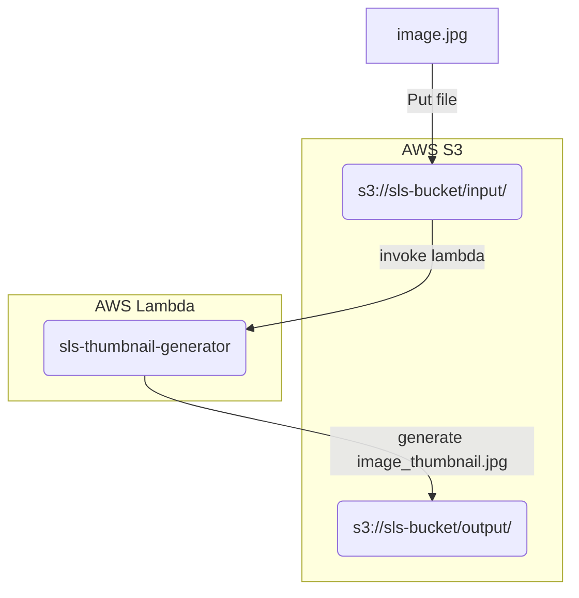

# Thumbnail Generator

Description: Generate a Thumbnail image in `128x128` using AWS Lambda with S3 events (AWS Lambda and S3 is simulated in your local).

Technologies:
- Python
- Serverless Framework in AWS
- Serverless Framework plugins (for local development):
  - serverless-offline
  - serverless-s3-local

**Architecture description**



## Instalation in local

```Bash
# Install serverless
npm install -g serverless

# Install serverless plugins
sls plugin install --name serverless-offline
sls plugin install --name serverless-s3-local

# Setup S3 for offline development
aws configure --profile s3local

# Setting the next values
#aws_access_key_id = S3RVER
#aws_secret_access_key = S3RVER
```

## Run in local

```Bash
# Run serverless offline
sls offline start

# Put file with S3
aws --endpoint http://localhost:4569 s3 cp ~/tmp/data.csv s3://local-bucket/userdata.csv --profile s3local
```
