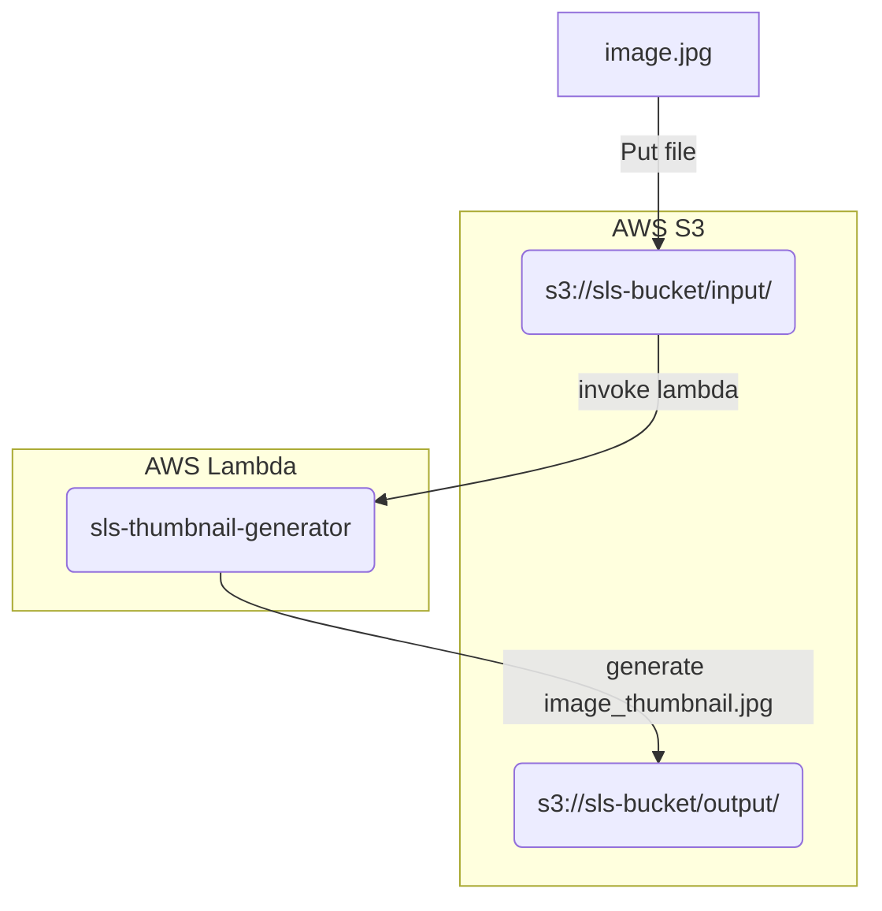

# Thumbnail Generator

Description: Generate a Thumbnail image in `128x128` using AWS Lambda with S3 events (AWS Lambda and S3 is simulated in your local).

Technologies:
- Python
- Serverless Framework in AWS
- Serverless Framework plugins (for local development):
  - serverless-offline
  - serverless-s3-local

**Architecture description**



## Instalation in local

```Bash
# Install serverless
npm install -g serverless

# Install serverless plugins
sls plugin install --name serverless-offline
sls plugin install --name serverless-s3-local

# Setup S3 for offline development. Setting values S3RVER
aws configure --profile s3local

# Install requirements to emulate [Lambda runtime for Python 3.9](https://docs.aws.amazon.com/lambda/latest/dg/lambda-runtimes.html)
# to implement pillow library in prod, use AWS Lambda Layer.
python3.9 -m venv venv
source venv/bin/activate
pip install -r requirements.txt
```

## Run in local

```Bash
# Run serverless offline
sls offline start

# Put file with S3
aws --endpoint http://localhost:4569 s3 cp ./sample.png s3://local-bucket/input/sample.png --profile s3local
```
