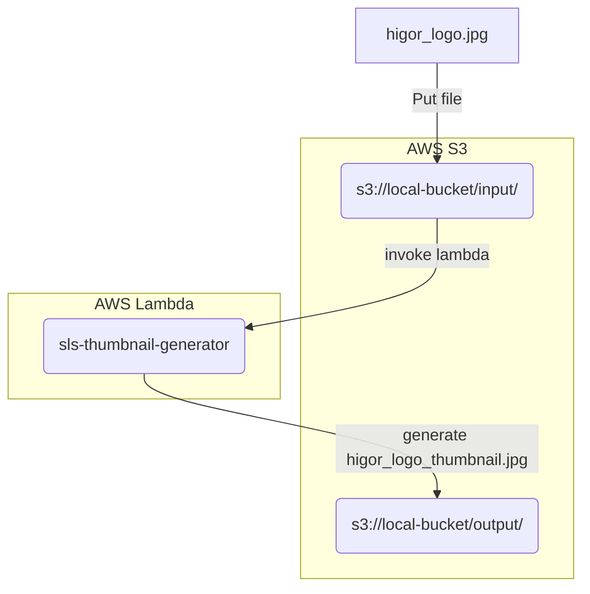

# Thumbnail Generator

Description: Generate a Thumbnail image in `128x128` using AWS Lambda with S3 events (AWS Lambda and S3 is simulated in your local).

Technologies:
- Python
- Serverless Framework in AWS
- Serverless Framework plugins (for local development):
  - serverless-offline: Simulate AWS Lambda in local.
  - serverless-s3-local: Simulate AWS S3 in local.

**Architecture description**



## Instalation in local

```Bash
# Install serverless
npm install -g serverless

# Install serverless plugins
sls plugin install --name serverless-offline
sls plugin install --name serverless-s3-local

# Setup S3 for offline development. Setting values S3RVER
aws configure --profile s3local

# Install requirements to emulate [Lambda runtime for Python 3.9](https://docs.aws.amazon.com/lambda/latest/dg/lambda-runtimes.html)
# to implement pillow library in prod, use AWS Lambda Layer.
python3.9 -m venv venv
source venv/bin/activate
pip install -r requirements.txt
```

## Run and probe in local

```Bash
# Run serverless offline
SLS_DEBUG=* sls offline start

# Download image
wget -O ./higor_logo.jpg https://raw.githubusercontent.com/osmandi/higor/master/higor_logo.jpg

# Open orignal image
open ./higor_logo.jpg

# Put file with S3
aws --endpoint http://localhost:4569 s3 cp ./higor_logo.jpg s3://local-bucket/input/higor_logo.jpg --profile s3local

# Download thumbnail generated
aws --endpoint http://localhost:4569 s3 cp s3://local-bucket/output/higor_logo_thumbnail.jpg . --profile s3local

# Open thumbnail generated
open ./higor_logo_thumbnail.jpg
```

## Optimize time and billing

- Use múltiples AWS Lambda depending with different memory allocation. Not make sense to use a lambda with 5 GB RAM to process a image with 10 MB.
- Create an AWS Lambda to simulate a distribution of what lambda will process an image depending of its size.
